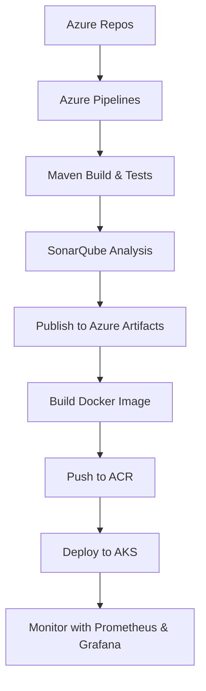

# Board-Game Listing WebApp POC – End-to-End DevOps Pipeline with Kubernetes

**Board Game Database Full-Stack Web Application.**

## 📌 Overview

This web application displays lists of board games and their reviews. While anyone can view the board game lists and reviews, they are required to log in to add/ edit the board games and their reviews. The 'users' have the authority to add board games to the list and add reviews, and the 'managers' have the authority to edit/ delete the reviews on top of the authorities of users.  

This project demonstrates a complete DevOps pipeline for a Java Spring Boot application using modern cloud-native tools. It covers the full lifecycle from source code to deployment and monitoring in Kubernetes.

The goal is to help teams understand and replicate a production-grade CI/CD setup using Azure DevOps, SonarQube, Docker, Azure Container Registry (ACR), Azure Kubernetes Service (AKS), and monitoring with Prometheus and Grafana.

---

## 🛠️ Tech Stack

- **Java 21** with Spring Boot 3.2.4, Spring MVC
- **Maven** for build and dependency management
- **Thymeleaf, Thymeleaf Fragments** 
- **JDBC, H2 Database Engine** (In-memory)
- **JUnit test framework** for unit testing
- **Spring Security**
- **Twitter Bootstrap**
- **Azure Repos** for source control
- **Azure Pipelines** for CI/CD
- **SonarQube** (self-hosted) for static code analysis
- **Azure Artifacts** for storing build packages
- **Docker** for containerization
- **Azure Container Registry (ACR)** for image storage
- **Azure Kubernetes Service (AKS)** for deployment
- **Prometheus + Grafana** for monitoring

---

## Features

- Full-Stack Application
- UI components created with Thymeleaf and styled with Twitter Bootstrap
- Authentication and authorization using Spring Security
  - Authentication by allowing the users to authenticate with a username and password
  - Authorization by granting different permissions based on the roles (non-members, users, and managers)
- Different roles (non-members, users, and managers) with varying levels of permissions
  - Non-members only can see the boardgame lists and reviews
  - Users can add board games and write reviews
  - Managers can edit and delete the reviews
- Deployed the application on Azure Kubernetes Service
- JUnit test framework for unit testing
- Spring MVC best practices to segregate views, controllers, and database packages
- JDBC for database connectivity and interaction
- CRUD (Create, Read, Update, Delete) operations for managing data in the database
- Schema.sql file to customize the schema and input initial data
- Thymeleaf Fragments to reduce redundancy of repeating HTML elements (head, footer, navigation)

---

## 🚀 POC Workflow

1. **Code in Azure Repos**
   - Java Spring Boot application stored in `Board-Game` repository

2. **Build with Azure Pipelines**
   - Compile code using Maven
   - Run unit tests
   - Generate code coverage with Jacoco
   - Run SonarQube analysis

3. **Publish to Azure Artifacts**
   - Package JAR and push to Azure Artifacts feed

4. **Create Docker Image**
   - Build Docker image using packaged JAR
   - Tag and push to ACR

5. **Deploy to AKS**
   - Use Kubernetes manifests or Helm charts
   - Expose service via LoadBalancer or Ingress

6. **Monitor with Prometheus & Grafana**
   - Scrape metrics from pods
   - Visualize dashboards in Grafana

---

### 🔁 CI/CD Pipeline Flow Diagram


---

## 📦 Project Structure

```
├── src/
│   └── main/java/...       # Source code
│   └── test/java/...       # Unit tests
├── pom.xml                 # Maven config
├── Dockerfile              # Containerize the project
├── manifests/              # Kubernetes deployment YAMLs
├── azure-pipelines.yml     # CI/CD
└── README.md               # This file
```

---

## 🧪 How to Replicate This POC

1. Clone the repo from Azure Repos
2. Set up Azure Pipeline with Maven build and SonarQube analysis
3. Configure Azure Artifacts feed
4. Add Dockerfile and build image in pipeline
5. Push image to ACR
6. Deploy to AKS using `kubectl` or Helm
7. Set up Prometheus and Grafana in AKS
8. Validate deployment and monitor metrics

---

## 📊 SonarQube Setup

> Note: This POC uses a **self-hosted SonarQube instance** on a VM.

- Install SonarQube on a Linux VM
- Configure Maven to use SonarQube scanner
- Add SonarQube analysis step in pipeline

---

## 📈 Monitoring Setup

- Deploy Prometheus and Grafana using Helm
- Configure Prometheus to scrape metrics from Spring Boot app
- Import dashboards in Grafana

---

## How to Run

1. Clone the repository
2. Open the project in your IDE of choice
3. Run the application
4. To use initial user data, use the following credentials.
  - username: bugs    |     password: bunny (user role)
  - username: daffy   |     password: duck  (manager role)
5. You can also sign-up as a new user and customize your role to play with the application! 😊

---

## 📣 Contact

For questions or contributions, please reach out to the project maintainer.

